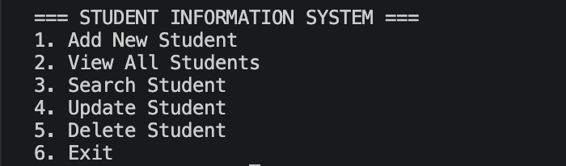

# 🎓 Student Information System (Java)

## Overview

The **Student Information System** is a console-based Java application designed to manage student records efficiently.
It allows users to perform essential operations such as adding, viewing, searching, updating, and deleting student data.

This project demonstrates the use of **Core Java concepts**, including Object-Oriented Programming (OOP), data structures, and user interaction through a menu-driven interface.

---

## Features

* ➕ Add new student records
* 📋 View all students in tabular format
* 🔍 Search student by ID
* ✏️ Update existing student details
* ❌ Delete student records
* ⚡ Menu-driven interactive system

---

## Technologies Used

* **Java (Core Java)**
* **ArrayList** (for dynamic data storage)
* **Scanner** (for user input handling)

---

## 📂 Project Structure

```
java-student-information-system/
│
├── README.md
├── src/
│   └── StudentInformationSystem.java
│
├── docs/
│   └── Documentation.txt
│
└── test_data/
    └── sample_data.txt
```


---

## ▶️ How to Run

### 1. Clone the repository

```
git clone https://github.com/Ratnam-1021/java-student-information-system.git
```

### 2. Navigate to source folder

```
cd java-student-information-system/src
```

### 3. Compile the program

```
javac StudentInformationSystem.java
```

### 4. Run the program

```
java StudentInformationSystem
```

---


## Project Screenshot




---


## Documentation

Complete project documentation is available here:  
[View Documentation](https://docs.google.com/document/d/18jjDPUdnQEi_AyVvm1Vs9pyiAgJr8WK3fQ9ntuVOXaA/edit?usp=sharing)


---

## 📊 Sample Input

```
Student ID: S101  
Name: Ratnam Singh  
Age: 20  
Grade: 8.5  
Contact: 9876543210  
```

---

## Sample Output

```
Student added successfully!
```

---

## Test Cases

* Add student with valid details → Success
* Search existing student → Display details
* Search invalid ID → "Student not found"
* Update student → Data updated successfully
* Delete student → Record removed

---

## ⚠️ Limitations

* Data is not stored permanently (no database/file storage)
* Data is lost after program termination
* Console-based interface (no GUI)

---

## Future Enhancements

* Add file handling or MySQL database for persistent storage
* Develop GUI using Java Swing or JavaFX
* Input validation and error handling improvements
* Authentication system (Admin/User roles)

---

## Author

**Ratnam Singh**
B.Tech CSE Student

---

## git add README.md
git commit -m "Added documentation link"
git pushAcknowledgement

This project was developed as part of learning and internship preparation to strengthen Java programming and problem-solving skills.
